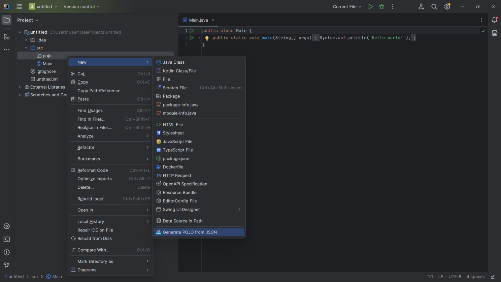

## JSON（JavaScript Object Notation）
是一種輕量級的數據交換格式，通常用於前端與後端之間的數據傳輸。JSON 格式易於讀寫，並且易於解析和生成。它基於 JavaScript 語法，但已成為一種獨立於語言的資料格式。

## POJO（Plain Old Java Object）
是一個簡單的 Java 物件，沒有任何特殊的要求或限制。POJO 不需要實現特定的介面或擁有特定的父類別，它僅僅是一個普通的 Java 類別，包含一些屬性（成員變數）和相應的 getter 和 setter 方法。

## 範例
1. 打開 IntelliJ IDEA IDE。
2. 在 IntelliJ IDEA 的工具欄上，找到 "File"（文件）菜單，然後選擇 "Settings"（設置）。在設置窗口中，找到 "Plugins"（插件）選項。
3. 在 "Plugins" 頁面上，你可以找到一個 "Marketplace"（市場）選項或類似的頁面。點擊進入插件市場。
4. 在插件市場中，搜尋框中輸入 "RoboPOJOGenerator"。你應該能夠看到相關的插件列表。
5. 找到 RoboPOJOGenerator 插件，然後點擊安裝按鈕。
6. 完成插件安裝後，IntelliJ IDEA 通常會提示你重新啟動應用程序。請按照提示重新啟動。
7. Select package -> new -> Generate POJO from JSON

