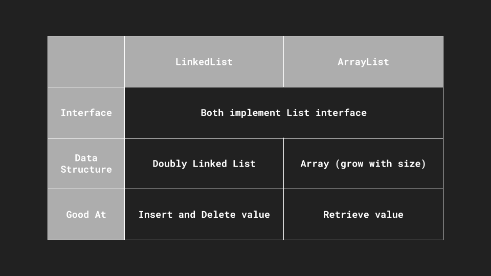

## ArrayList

* 資料結構： ArrayList 使用動態陣列（Dynamic Array）作為資料結構，這使得對元素的隨機訪問（random access）非常高效。
* 性能： 在隨機訪問元素時，ArrayList 的性能較好，因為它允許通過索引直接訪問元素。
* 插入和刪除： 對於插入和刪除操作，特別是在中間位置進行操作，ArrayList 的性能相對較差，因為它需要移動元素。
* 空間占用： ArrayList 在創建時需要分配一定的空間，並且當空間不足時需要進行擴充操作。

## LinkedList

* 資料結構： LinkedList 使用雙向鏈結串列（Doubly Linked List）作為資料結構，這使得插入和刪除操作在某些情況下更有效率。
* 性能： 在循序走訪元素時，LinkedList 的性能較好，因為它知道前後相鄰元素的指標位置。
* 插入和刪除： LinkedList 對於插入和刪除操作的性能較好，特別是在中間位置進行操作，因為它只需要調整鏈結而不需要移動大量元素。
* 空間占用： LinkedList 不需要一開始分配大量的空間，它根據實際需求動態分配空間。

結論，如果需要頻繁進行隨機訪問元素，使用 ArrayList 較為適合。如果需要頻繁進行插入和刪除操作，特別是在中間位置進行操作，則 LinkedList 可能更適合。