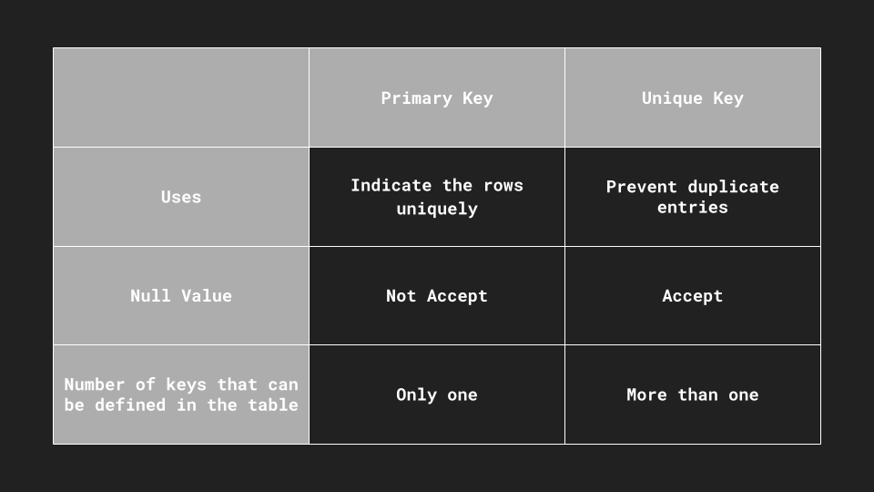

## 主鍵（Primary Key）
* 主鍵是一個用於唯一標識資料表中每一行的欄位或一組欄位。
* 一個資料表只能有一個主鍵。
* 主鍵欄位不能包含NULL值，且必須保持唯一。
* 主鍵的目的是提供一種快速查找資料表中特定行的方法，並確保每一行都有一個唯一標識。

## 唯一鍵（Unique Key）
* 唯一鍵用於確保資料表中某一列（或一組列）的數值唯一性，但它可以包含NULL值。
* 一個資料表可以有多個唯一鍵。
* 與主鍵不同，唯一鍵的目的是確保資料表中的某列數值是唯一的，而不一定是用於標識特定行。

總結來說，主鍵用於唯一標識每一行，而唯一鍵用於確保某一列的數值唯一性，但允許包含NULL值。